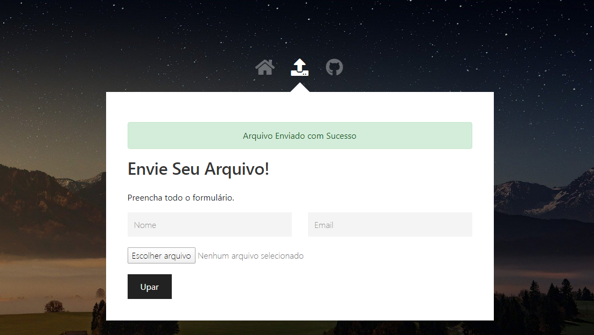

# Upa Ai
> Uma aplicação com upload de arquivo.

[![Express Handlebars][handlebars]][handlebars-url]

Um app que permite fazer upload de arquivos.




## Exemplo de uso
_Foi feito o deploy no Heroku com a página estática:  [App][app]._ 

## Configuração para Desenvolvimento

Depois do download do projeto e com o node instalado na maquina, rode o seguinte comando:

```sh
npm i
```

## Histórico de lançamentos

* 0.0.1
    * Trabalho em andamento

## Meta

Gabriel Mussolini – gabrielmussolini@hotmail.com

[GITHUB](https://github.com/gabrielmussolini984)

## Contributing

1. Faça o _fork_ do projeto (<https://github.com/gabrielmussolini984/UpaAi/fork>)
2. Crie uma _branch_ para sua modificação (`git checkout -b feature/fooBar`)
3. Faça o _commit_ (`git commit -am 'Descrição'`)
4. _Push_ (`git push origin feature/fooBar`)
5. Crie um novo _Pull Request_


[handlebars]: https://img.shields.io/badge/-Handlebars-orange
[handlebars-url]: https://handlebarsjs.com/

[app]: https://upa-ai.herokuapp.com/


